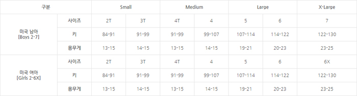
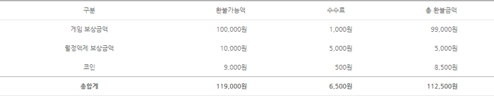

CSS 컴포넌트
============
> Table, Form, List 요소들의 재사용성과 확장성을 고려한 CSS 컴포넌트를 주목적으로 만들어졌습니다.

# 목차
1. 문서 주요특징
2. Table Element
3. Form Element
4. List Element

## 1. 문서 주요특징
- Secioning Content를 사용해 명시적으로 섹션을 구분
- 웹표준과 웹접근성 반영
- 적절한 주석을 사용한 코드 가독성을 향상
- 각 요소들의 재사용성과 확장성을 고려한 CSS 컴포넌트

## 2. Table Element
열 그룹의 너비는 `<col>`요소에 inline style로 제어합니다.

### 2.1. 기본 표
표의 외각 테두리 선과 각 셀에 테두리 선이 있는 기본 표를 사용하려면 `<table>`에 `.table_bordered`를 추가하세요.
      

```html
<table class="table table_bordered">
...
</table>
```

### 2.2. 기본 표2
머리글과 바닥글만 수평선으로 구분한 표를 사용하려면 `.table_bordered v2`를 추가하세요.
  

```html
<table class="table table_bordered v2">
...
</table>
```
  
### 3. form Element
  
### 4. List Element
